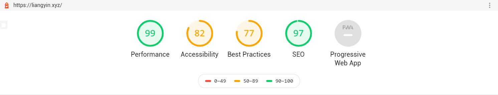

ThemeVersion: 0.13
# hexo-theme-EYins
一个Hexo主题 - EYins - 简洁不简单。

性能、美观、SEO,样样俱全。



原作https://github.com/wa-ri/hexo-theme-ztopic。

## 说明
[DEMO](https://liangyin.xyz)

[文档](https://liangyin233.github.io/EYins-docs/#/)

PS:如果你也在使用这款主题,欢迎向我提交你的链接,展示在本页面

注意事项:

本主题默认展开所有博文，请在文章中标注``<!-- more -->``来规定收起位置。

本主题处于开发阶段，如果有Bug或建议,欢迎在Issues反馈

## 安装
```
$ npm install --save hexo-renderer-sass
$ git clone https://github.com/LiangYin233/hexo-theme-EYins.git themes/EYins
```

# English:

A Hexo Theme - EYins - Simplicity is not simple.

Performance, beauty, SEO, everything.


Original at https://github.com/wa-ri/hexo-theme-ztopic.

## Description
[DEMO](https://liangyin.xyz)

[Docs](https://liangyin233.github.io/EYins-docs/#/)

PS:If you are also using this theme, feel free to submit your link to me and show it on this page

Note:

All blog posts in this topic will be opened by default, please mark ``<! -- more -->`` to specify the place to put it away.

This topic is in the development stage, if you have any bugs or suggestions, welcome to feedback at Issues!

## Install
```
$ npm install --save hexo-renderer-sass
$ git clone https://github.com/LiangYin233/hexo-theme-EYins.git themes/EYins
```
