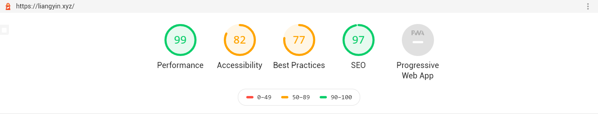

ThemeVersion: 0.14
# hexo-theme-EYins
[中文文档](https://github.com/YinsTeam/hexo-theme-EYins/blob/master/README.md)
[English docs](https://github.com/YinsTeam/hexo-theme-EYins/blob/master/README.en.md)
---
一個Hexo主題 - EYins - 簡潔不簡單。

性能、美觀、SEO,樣樣俱全。



原作https://github.com/wa-ri/hexo-theme-ztopic。

## 說明
[DEMO](https://liangyin.xyz)

[文檔](https://github.com/LiangYin233/EYins-docs/)

PS:如果你也在使用這款主題,歡迎向我提交你的鏈接,展示在本頁面

注意事項:

本主題默認展開所有博文，請在文章中標註<!-- more -->來規定收起位置。

本主題處於開發階段，如果有Bug或建議,歡迎在Issues反饋

## 安裝
```
$ npm install --save hexo-renderer-sass
$ git clone https://github.com/LiangYin233/hexo-theme-EYins.git themes/EYins
```
